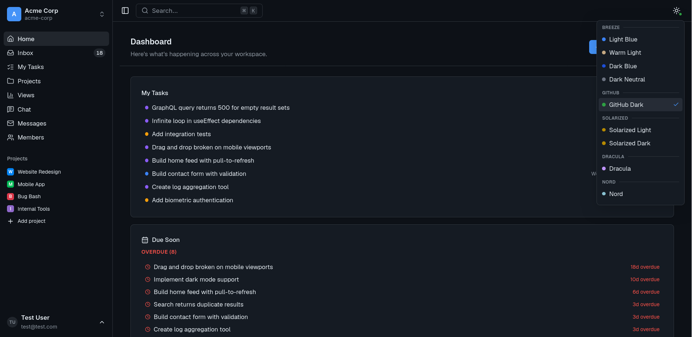
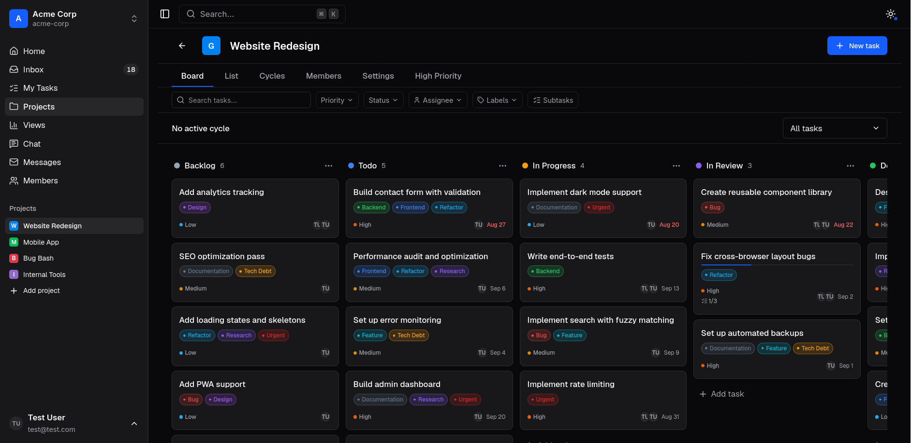
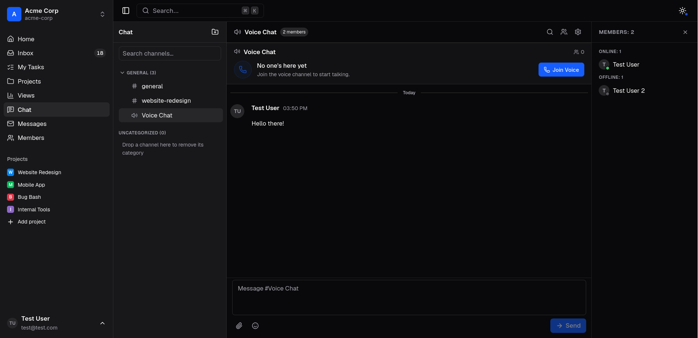

# Breeze

> **Status: beta (v0.1.0).** Early, unstable release — APIs and data schemas
> may change between versions. Back up your data before upgrading.

Self-hosted project management and team collaboration in a single binary:
projects, tasks, chat, and voice channels, with an embedded web UI and a
SQLite database. No external services to run.

## Screenshots

<p align="center">
  
  <br>
  <em>Dashboard overview</em>
</p>

<p align="center">
  
  <br>
  <em>Kanban board</em>
</p>

<p align="center">
  
  <br>
  <em>Workspace chat</em>
</p>

## Features

### Project management
- Multi-workspace (organization) support with a workspace switcher
- Projects, tasks, statuses, cycles, subtasks, labels, attachments, and time tracking
- Kanban board and list views, plus saved cross-project views
- "My Issues" cross-project task view
- Dashboard overview and command palette (Cmd/Ctrl+K)

### Collaboration
- Chat: channels, categories, DMs, group DMs, threads, reactions,
  pins, typing indicators, and presence
- Voice channels over WebRTC, with TURN relay support
- Real-time WebSocket layer for notifications, presence, and message events

### Security and access control
- Granular role-based access: org roles, project memberships, per-channel overrides
- Invite flow for bringing teammates in
- Argon2id password hashing and JWT sessions in HttpOnly cookies
- Org-scoped data isolation

## Tech stack

| Layer          | Technology                                              |
| -------------- | ------------------------------------------------------- |
| Backend        | Go, chi router, go-chi/render, standard library net/http |
| Database       | SQLite via modernc.org/sqlite (pure Go, no CGO)         |
| Query layer    | sqlc, type-safe code generation from SQL                |
| Migrations     | pressly/goose, embedded and auto-run on startup         |
| Auth           | golang-jwt/jwt/v5 and argon2id                          |
| API docs       | swaggo/swag, OpenAPI 2.0 from Go annotations            |
| Frontend       | Vite, Lit 3, TypeScript (Deno toolchain)                |
| State          | @preact/signals-core                                    |

## Quick start

### Requirements

- Go 1.26 or newer (see `go.mod`)
- Deno, used as the frontend toolchain (see `ui/`)
- For development only: the global tools `air`, `sqlc`, and `swag`
  (installed by `make setup`)

To run the app you only need the built binary; the prerequisites above apply
to building from source.

### Build and run

```bash
# 1. Create your configuration from the example
cp .env.example .env
#    Edit .env and set JWT_SECRET (required, at least 32 characters)

# 2. Build the UI and the Go binary (output: bin/breeze)
make build

# 3. Run it (listens on PORT, default 8080)
./bin/breeze
```

Open http://localhost:8080. The first-run setup wizard guides you through
creating your organization and admin account. Database migrations run
automatically on startup.

Generate a secret with:

```bash
openssl rand -base64 32
```

### Run with Docker

A `compose.yaml` is included. It builds the image, runs as a non-root user,
and keeps the database and uploads in a named volume.

```bash
cp .env.example .env       # set JWT_SECRET first
docker compose up -d
```

See [docs/ops/setup.md](docs/ops/setup.md) for systemd, backups, upgrades,
and reverse-proxy examples.

## Configuration

Breeze is configured with environment variables, optionally loaded from a
`.env` file. The full reference is in
[docs/ops/configuration.md](docs/ops/configuration.md).

| Variable     | Default            | Description                          |
| ------------ | ------------------ | ------------------------------------ |
| `PORT`       | `8080`             | HTTP listen port                     |
| `DB_PATH`    | `./data/breeze.db` | Path to the SQLite database file     |
| `UPLOAD_DIR` | `./data/uploads`   | Directory for uploaded attachments   |
| `JWT_SECRET` | required           | Secret key for signing JWT tokens (at least 32 characters) |

## Project layout

```
cmd/          Entry points (server, seed)
internal/     Go source: domain, port, store, service, transport, auth, ...
ui/           Vite + Lit SPA
api/swagger/  Generated OpenAPI spec
docs/         Documentation (api/, ui/, ops/, i18n/)
```

The codebase follows a layered architecture: domain, port, store, service,
transport. See [docs/api/architecture.md](docs/api/architecture.md) and
[docs/README.md](docs/README.md) for details.

## Development

Use the `make` targets for common tasks; the full list is in
[docs/api/build-commands.md](docs/api/build-commands.md).

```bash
make dev            # Hot-reload dev server (requires air and Deno)
make test           # Run Go tests
make test-ui        # Run UI tests
make build          # Build UI and Go binary
make regen-all      # Regenerate sqlc, swagger, and API types
make seed           # Seed the database with sample data
```

`make dev` starts long-running watch processes. To verify changes without a
dev server, use `make build` and `make test` instead.

## Documentation

Documentation lives in `docs/` and is split by topic:

| Section       | Covers                                    |
| ------------- | ----------------------------------------- |
| `docs/api/`   | Backend architecture, API, permissions    |
| `docs/ui/`    | Frontend stack, patterns, pitfalls        |
| `docs/ops/`   | Deployment, configuration, self-hosting   |
| `docs/i18n/`  | Internationalization                      |

Start at [docs/README.md](docs/README.md).

## Contributing

Contributions are welcome!

Feel free to open an issue to report a bug, request a feature, or ask a question. If you would like to contribute code, please fork the repository and open a pull request.

For larger changes, please open an issue first to discuss what you would like to change. Ensure your pull request passes `make build` and `make test`.

> [!IMPORTANT]
> This project uses AI agents to assist with development. The primary tooling includes [Pi Agent](https://pi.dev) and [OpenCode 2](https://opencode.ai/), which use open-weight models such as DeepSeek V4 Pro 0813, GLM 5.2, and Kimi K3.